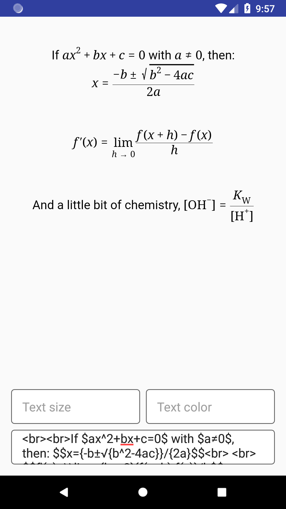
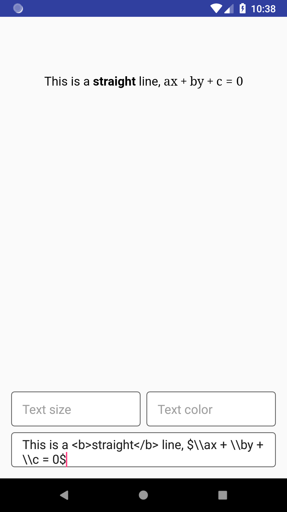

[](https://jitpack.io/#frhnfrq/MathView)

# MathView 

`MathView` is a library to render Math equations in Android. It uses [jqMath](https://mathscribe.com/author/jqmath.html) to render math equations.

## Setup

Add it in your **root** build.gradle at the end of repositories:

```groovy
allprojects {
    repositories {
		...
		maven { url 'https://jitpack.io' }
	}
}
```

Add `implementation 'com.github.frhnfrq:MathView:1.0'` into **dependencies** section of your **module** build.gradle file. For example:

```groovy
dependencies {
    implementation 'com.github.frhnfrq:MathView:1.0'
}
```
## Usage

#### Add `MathView` in your layout

```xml
<com.zanvent.mathview.MathView
    android:id="@+id/mathview"
    android:layout_width="match_parent"
    android:layout_height="wrap_content" />
```

#### Get an instance of it in your code
```java
MathView mathview = findViewById(R.id.mathview);
mathview.setText("If $ax^2+bx+c=0$ with $a≠0$, then: $$x={-b±√{b^2-4ac}}/{2a}$$");
mathview.setPixelScaleType(Scale.SCALE_DP);
mathview.setTextSize(16);
mathview.setTextColor("#111111");
```

## Screenshot


## How to

To learn how to write math equations in it, please have a look at [jqMath](https://mathscribe.com/author/jqmath.html).

## Advantages

1. Faster than MathJax.
2. Change text size and color easily.
3. Supports HTML outside of the equation. Example 
  ```java
  mathview.setText("This is a <b>straight</b> line, $\ax + \by = \c$");
  ``` 


## Disadvantages

1. Special symbols are typed manually. Example: √ ∑ ∫ ← → + >
2. Some parts of the MathML standard are not yet implemented in jqMath, such as elementary school mathematics (e.g. “long division”), and “Content MathML.”


License
=======

    MIT License

    Copyright (c) 2018 Farhan Farooqui

    Permission is hereby granted, free of charge, to any person obtaining a copy
    of this software and associated documentation files (the "Software"), to deal
    in the Software without restriction, including without limitation the rights
    to use, copy, modify, merge, publish, distribute, sublicense, and/or sell
    copies of the Software, and to permit persons to whom the Software is
    furnished to do so, subject to the following conditions:

    The above copyright notice and this permission notice shall be included in all
    copies or substantial portions of the Software.

    THE SOFTWARE IS PROVIDED "AS IS", WITHOUT WARRANTY OF ANY KIND, EXPRESS OR
    IMPLIED, INCLUDING BUT NOT LIMITED TO THE WARRANTIES OF MERCHANTABILITY,
    FITNESS FOR A PARTICULAR PURPOSE AND NONINFRINGEMENT. IN NO EVENT SHALL THE
    AUTHORS OR COPYRIGHT HOLDERS BE LIABLE FOR ANY CLAIM, DAMAGES OR OTHER
    LIABILITY, WHETHER IN AN ACTION OF CONTRACT, TORT OR OTHERWISE, ARISING FROM,
    OUT OF OR IN CONNECTION WITH THE SOFTWARE OR THE USE OR OTHER DEALINGS IN THE
    SOFTWARE.
